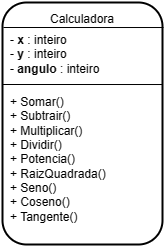
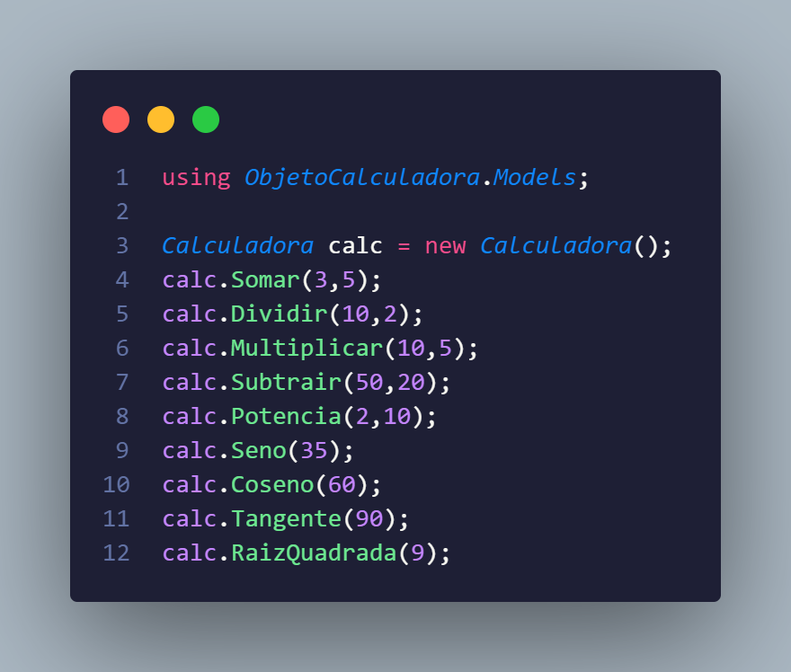

## Projeto Calculadora

Para este projeto, precisei usar meus conhecimentos adquiridos de orientação a objeto.

## Proposta

Precisarei construir uma classe chamada "Calculadora", conforme o diagrama abaixo:

A classe contém três variáveis, sendo elas:

**x**: Tipo inteiro. É o primeiro número a ser inserido.

**y**: Tipo inteiro. É o segundo número a ser inserido.

**angulo**: Tipo inteiro. É o valor do ângulo a ser inserido.

 
A classe contém nove métodos, sendo:

**Somar**: Método responsável por receber dois valores e exibir no console a soma dos dois números inteiros (x,y).

**Subtrair**: Método responsável por receber dois valores e exibir no console a subtração do primeiro número pelo segundo (x,y).

**Multiplicar**: Método responsável por receber dois valores e exibir no console o resultado da multiplicação (x,y).

**Dividir**: Método responsável por receber dois valores e exibir no console o resultado da divisão do primeiro número pelo segundo (x,y).

**Potencia**: Método responsável por receber dois valores e exibir no console o resultado da potenciação do primeiro número elevado ao segundo (x,y).

**RaizQuadrada**: Método responsável por receber um número e exibir no console o resultado da raiz quadrada deste número (x).

**Seno**: Método responsável por receber o valor numérico de um ângulo e exibir no console o valor do seno desse ângulo (angulo).

**Coseno**: Método responsável por receber o valor numérico de um ângulo e exibir no console o valor do coseno desse ângulo (angulo).

**Tangente**: Método responsável por receber o valor numérico de um ângulo e exibir no console o valor da tangente desse ângulo (angulo).

## Exemplo

Fazemos a instância do objeto calculadora e através dos métodos realizamos os cálculos passandos os parâmetros

## Métodos

Em todos os métodos foram adicionado o <b>\<sumary> e \<param></b> para deixar o mais claro possível como utilizar cada método, como podemos visualizar abaixo:

